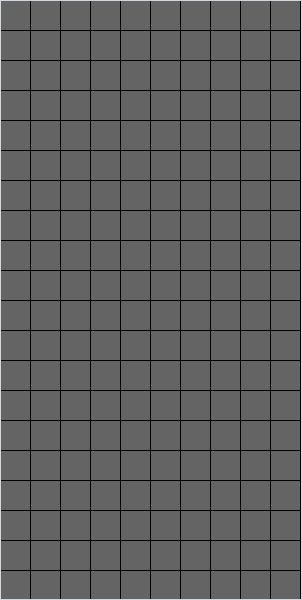

<div align="center">

# Tetris

*A Tetris clone in Pygame where each piece is a 5 × 5 matrix with all four rotations computed in advance.*




</div>

## About

A Tetris clone written from scratch in a single Pygame file. The seven tetrominoes fall into a 10 × 20 well, rotate both ways, lock when they land, and full rows are removed. Each piece is a 5 × 5 integer matrix whose value doubles as its colour index, and the falling piece is stamped straight into the same grid that holds the locked blocks.

## Quick start

```bash
python -m pip install -r requirements.txt
python tetris.py
```

As committed, the window is only 80 × 80 pixels; set `tamano_cuadros = 30` near the top of `tetris.py` for a playable 600 × 600 window.

## Controls

| Input | Action |
| --- | --- |
| <kbd>A</kbd> / <kbd>D</kbd> | Move the piece left / right |
| <kbd>→</kbd> | Rotate clockwise |
| <kbd>←</kbd> | Rotate counter-clockwise |
| <kbd>↓</kbd> | Drop one row |
| Close the window | Quit |

## How it works

- **Pieces as matrices.** Each tetromino is a 5 × 5 matrix inside a `Pieza` (piece) object. Non-zero entries are blocks, and the value 1 to 7 selects the colour: orange L, blue reverse L, green S, red Z, purple T, yellow square and cyan I.
- **Rotations computed once.** `girar_array_cuadrado` (rotate square array) turns a matrix $A$ by 90° clockwise. Applied three times, it gives the four orientations that the arrow keys cycle through:

  ```math
  R_{j,\;n-1-i} = A_{i,\,j}, \qquad n = 5
  ```

- **One grid for everything.** The board `array_juego` is a 20 × 10 list of colour indices. Every frame the falling piece's old cells are set back to 0, the piece is stamped at its current corner position, and its cell coordinates are recorded for the collision check.
- **Falling and locking.** A counter advances once per pass of the main loop. When it reaches 1000 (`tiempo_entre_bajadas`, time between drops) the piece tries to move down a row. If any block sits on the bottom row, or the cell below it is occupied by something other than the piece itself, the piece locks and a random new one appears with its 5 × 5 box at column 2, row 0.
- **Line clears.** On every lock, `comprobar_filas` (check rows) scans the rows from top to bottom. A row with no zeros is removed and an empty row is inserted at the top, which shifts everything above it down by one.
- **Score.** `puntuacion` (score) gains 10 per locked piece and 100 per cleared row.

## Limitations

- Moving and rotating have no wall or overlap checks. Pushing a piece past the right wall, or rotating it next to the floor, crashes with `IndexError`; past the left wall it wraps to the other side through Python's negative indexing. A piece moved into the stack overwrites locked blocks, and they vanish when it moves on.
- The score is computed but never drawn: the text is rendered once and never blitted, so the right half of the window stays empty.
- There is no game over. Once the stack reaches the top, each new piece locks where it appears and play goes on.
- The fall speed is counted in loop passes rather than time, with no frame cap, so it depends on the machine. The rotation index is printed to the console every frame.
- The background music lines for `tetris.mp3` are commented out, and the audio file is not part of this repository.

---

<div align="center"><sub>Part of <a href="https://github.com/lnivan">lnivan's projects</a> · <b>Games</b></sub></div>
